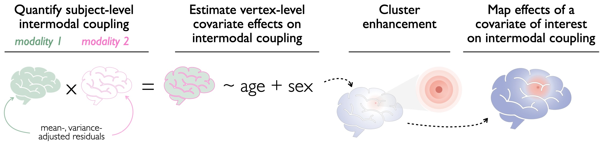

<!-- README.md is generated from README.Rmd. Please edit that file -->

```{r, include = FALSE}
knitr::opts_chunk$set(
  collapse = TRUE,
  comment = "#>",
  fig.path = "man/figures/README-",
  out.width = "100%"
)
```

# CEIDR

<!-- badges: start -->
<!-- badges: end -->

#### **Cluster Enhancement for testing Individual Differences in $\rho$ (r)**


<br>


<br>

## Installation

You can install the development version of CEIDR like so:

```{r, eval = FALSE}
# install.packages("devtools")
devtools::install_github("RuyiPan/CEIDR")
```

## Example

This is a basic example which shows you how to solve a common problem:

```{r example, message=FALSE, eval = FALSE}
library(CEIDR)
data("Data")
## basic example code
testing_res1 <- Ceidr(Data$m1, Data$m2, Data$cov.df, Data$distmat, 
                      cov.interest = c("x"),  cov.nuisance = c("z"))
```

Different permutation approach
```{r permutation, eval = FALSE}
testing_res1 <- Ceidr(Data$m1, Data$m2, Data$cov.df, Data$distmat,
                      cov.interest = c("x"),  cov.nuisance = c("z"),
                      perm="Manly")
testing_res2 <- Ceidr(Data$m1, Data$m2, Data$cov.df, Data$distmat, 
                      cov.interest = c("x"),  cov.nuisance = c("z"),
                      perm="Draper–Stoneman")
```

You can design you own gamlss model for between-subject adjustment
```{r gamlss, eval = FALSE}
# design your gamlss model
bewteen.mod <- list(mu.formula1= y ~x+z, sigma.formula1=~1, family1=NO(),
                  mu.formula2= y ~x+z, sigma.formula2=~1, family2=NO())
testing_res3 <- Ceidr(Data$m1, Data$m2, Data$cov.df, Data$distmat, 
                      cov.interest = c("x"),  cov.nuisance = c("z"),
                      bewteen.mod = bewteen.mod,
                      perm="Draper–Stoneman")
```


